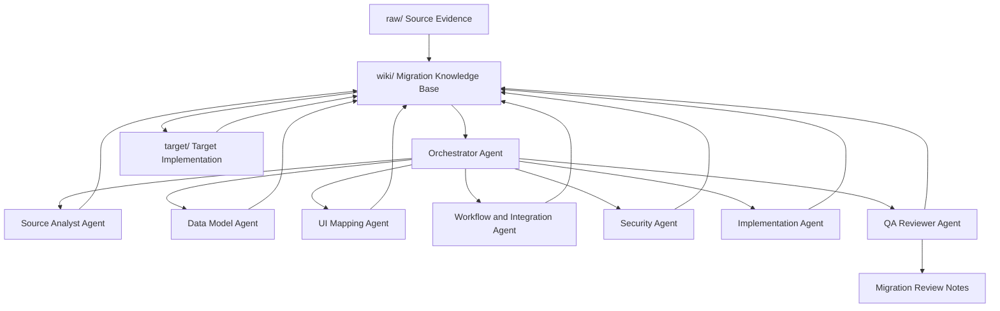
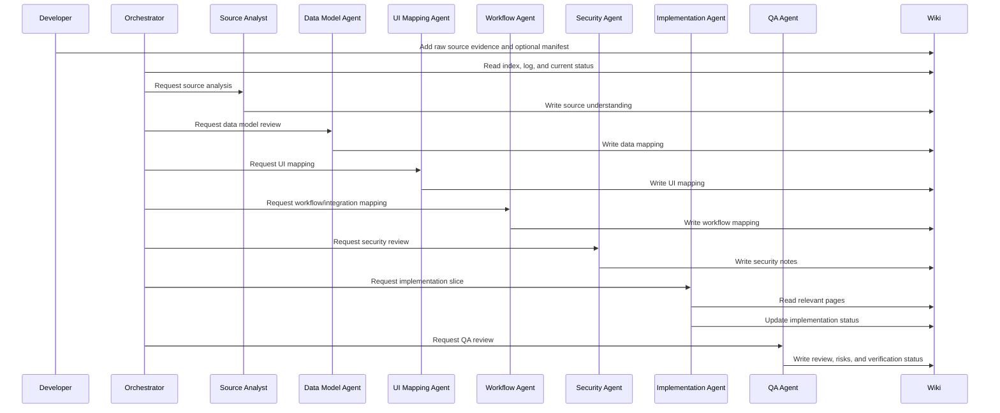

# AI Agent Council

This document explains the optional AI Agent Council pattern for complex LLM Wiki projects, especially enterprise application migration.

It is intended for human readers who want to understand how multiple specialised AI agents can collaborate using the same migration wiki.

Operational rules for agents should still be placed in `AGENTS.md`.

## What is an AI Agent Council?

An AI Agent Council is a group of specialised AI agents that work together on the same migration project.

Each agent has a focused responsibility.

For example:

* one agent analyses the source system
* one agent designs the data model
* one agent maps the UI
* one agent reviews workflows
* one agent checks security
* one agent implements code
* one agent performs QA review

The council is useful for large applications where one general-purpose agent may miss details or mix too many responsibilities.

## Core idea

The council does not mean agents share private hidden reasoning.

Instead, the council means:

> Multiple specialised agents read the same wiki, perform role-specific work, and write their findings back into shared project files.

The shared wiki is the coordination mechanism.

```txt
raw/    = source evidence
wiki/   = shared project memory
target/ = implementation or outputs
```

This matters because subagents can lose context during handoffs. The council pattern treats the wiki as the durable handoff surface: each agent reads the same relevant pages, contributes role-specific findings, and writes decisions, assumptions, risks, and verification notes back to the wiki.

## Why use an Agent Council?

Enterprise migration often has many dimensions:

* data model
* UI
* business rules
* workflow
* integrations
* permissions
* testing
* deployment
* change management

A single agent can work on all of these, but the risk is that it may overlook something.

A council approach improves review quality by separating concerns.

For example:

```txt
Data Model Agent:
- focuses on entities, fields, relationships, and constraints

Security Agent:
- focuses on roles, permissions, sensitive data, and access control

QA Agent:
- focuses on traceability, testing, and completeness
```

Each agent sees the system from a different perspective.

## Council architecture



## Main council roles

### 1. Orchestrator Agent

The Orchestrator Agent coordinates the overall migration process.

Responsibilities:

* read the current wiki state
* identify next migration priorities
* assign work to specialised agents
* detect blockers
* maintain task order
* prevent agents from working from outdated assumptions
* ensure the wiki is updated after each step

The orchestrator should not be the only source of truth. It coordinates using the wiki.

### 2. Source Analyst Agent

The Source Analyst Agent studies the source application.

Responsibilities:

* inspect files under `raw/`
* read `raw/manifest.md` when present or useful
* identify source screens, entities, workflows, roles, and integrations
* create source understanding pages in the wiki
* mark unclear or missing evidence
* avoid unsupported assumptions

Outputs:

* source inventory
* source app overview
* screen catalogue
* data object catalogue
* workflow catalogue
* open questions

### 3. Data Model Agent

The Data Model Agent focuses on data.

Responsibilities:

* analyse source data objects
* identify fields, relationships, statuses, and ownership rules
* propose target data model
* detect duplicate or conflicting mappings
* preserve required fields and relationships
* document target data decisions

Outputs:

* source data model notes
* target data model mapping
* data constraints
* data-related risks
* data migration assumptions

### 4. UI Mapping Agent

The UI Mapping Agent focuses on screens and user experience.

Responsibilities:

* analyse source UI screenshots
* identify pages, forms, lists, actions, filters, buttons, and navigation
* map source screens to target pages/components
* preserve important user flows
* identify reusable UI patterns
* record uncertain UI behaviour

Outputs:

* screen pages
* user flow notes
* target UI mapping
* UI migration backlog items

### 5. Workflow and Integration Agent

The Workflow and Integration Agent focuses on process behaviour and side effects.

Responsibilities:

* analyse source workflows and automations
* identify approval steps, status transitions, notifications, timers, and integrations
* map source workflows to target workflow mechanisms
* identify external APIs or services
* record side effects and failure cases
* flag missing workflow evidence

Outputs:

* workflow catalogue
* integration catalogue
* target workflow mapping
* process risks
* open questions

### 6. Security Agent

The Security Agent focuses on roles, permissions, and sensitive operations.

Responsibilities:

* identify source roles and permission rules
* map source roles to target access model
* check whether target permissions are too broad
* identify sensitive data and privileged actions
* review security assumptions
* record unresolved access-control questions

Outputs:

* role mapping
* permission matrix
* security risks
* security review notes

### 7. Implementation Agent

The Implementation Agent builds migration slices.

Responsibilities:

* read relevant wiki pages before coding
* implement one migration slice at a time
* follow target architecture decisions
* preserve source behaviour where possible
* avoid unrelated refactors
* update the wiki after implementation
* report files changed and tests performed

Outputs:

* target implementation changes
* updated implementation status
* updated traceability matrix
* updated test notes

### 8. QA Reviewer Agent

The QA Reviewer Agent checks quality and completeness.

Responsibilities:

* compare target implementation against source evidence
* check source-to-target traceability
* verify test coverage
* identify incomplete migration slices
* detect stale wiki pages
* find contradictions between wiki and implementation
* review open questions and risks

Outputs:

* QA review notes
* test status updates
* traceability gaps
* migration readiness assessment
* recommended next actions

## Shared workflow

The council should follow a wiki-first workflow.



## Council operating rules

The council works best when every agent follows these rules:

1. Read the wiki before acting.
2. Do not rely on private chat memory.
3. Do not treat assumptions as facts.
4. Write useful findings back to the wiki.
5. Mark unclear information clearly.
6. Preserve source-to-target traceability.
7. Update `wiki/log.md` after meaningful work.
8. Keep implementation and wiki in sync.
9. Escalate contradictions instead of silently choosing one side.
10. Let QA review completeness before calling a slice done.
11. Use `wiki/capabilities.md` when it exists to choose only the skills, plugins, MCP servers, or subagents needed for the current task.
12. Record meaningful council outputs in the wiki and append a concise entry to `wiki/log.md`.

## Shared source of truth

The shared source of truth order should be:

```txt
1. raw/ source evidence
2. raw/manifest.md when present or useful
3. wiki/ generated knowledge base
4. target/ implementation or outputs
5. human decisions recorded in ADRs or wiki logs
```

Private chat memory should not be treated as authoritative.

If something important is discussed in chat, it should be written into the wiki.

## Council and agile migration

The Agent Council can fit into an agile or Scrum-like migration process.

```txt
Discovery:
- Source Analyst builds source understanding
- Data/UI/Workflow/Security agents identify risks

Backlog creation:
- Orchestrator converts wiki findings into migration slices

Sprint planning:
- Council selects migration slice based on risk and dependency

Implementation:
- Implementation Agent builds the selected slice

Review:
- QA Agent checks source-to-target traceability

Retrospective:
- Council updates risks, assumptions, and next actions in the wiki
```

## Definition of done for a council task

A council task is done only when:

1. The assigned work is completed.
2. The relevant wiki pages are updated.
3. Important assumptions are recorded.
4. Risks or open questions are recorded.
5. Traceability is updated where relevant.
6. `wiki/log.md` is updated.
7. A reviewer can understand what changed without reading private chat history.

## When to use the council pattern

Use the Agent Council pattern when:

* the source app is large
* the app has many modules
* the data model is complex
* workflows are business-critical
* security rules are important
* multiple developers or agents are involved
* the migration must be reviewed or audited
* source evidence is incomplete or scattered
* the target platform is significantly different from the source platform

For small apps, a single AI agent may be enough.

## Practical folder suggestion

A project may optionally include:

```txt
council/
  README.md
  roles.md
  review-protocol.md
  council-log.md
```

However, this folder is optional.

The wiki remains the main shared memory.

## Important principle

The Agent Council is not about making agents talk endlessly.

It is about separating responsibilities while keeping knowledge shared and traceable.

The council is useful only if its findings are written back into the wiki.

> No council decision should live only in private chat history.
