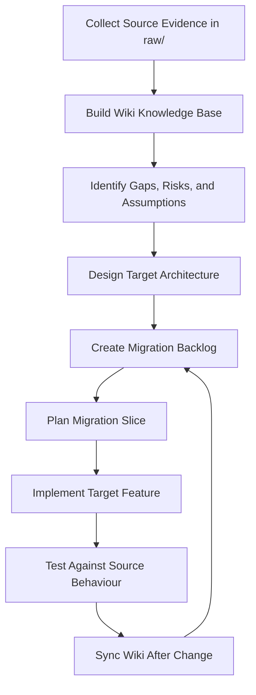

# SDLC Wiki Workflow

This document explains the wiki-driven SDLC workflow used when the LLM Wiki drives implementation work, especially application migration.

The purpose of the wiki is to act as the shared migration memory between developers and AI agents.

The wiki is not just documentation written after implementation. It is used throughout the full software development lifecycle.

For the general LLM Wiki method, see `docs/LLM_WIKI_METHOD.md`.

## Core idea

A migration project usually starts with incomplete and scattered source evidence:

* screenshots
* database diagrams
* workflow screenshots
* source exports
* old documentation
* human notes
* business assumptions

The AI agent first converts this raw evidence into a structured wiki.

After that, the wiki becomes the control system for design, backlog planning, implementation, testing, and review.

## SDLC flow

## Agile interpretation

The wiki supports an agile migration process.

### Discovery

Developers collect source materials under `raw/`.

The AI agent reads the raw evidence and creates the initial wiki.

### Backlog creation

The agent converts source features into migration backlog items.

Examples:

* source screen to target page
* source entity to target table
* source workflow to target automation
* source role to target permission model

### Sprint planning

Before implementing a migration slice, the agent reads:

* `wiki/index.md`
* `wiki/log.md`
* relevant source pages
* relevant target mapping pages
* open questions and risks
* traceability matrix

The agent then chooses a clear migration slice.

### Sprint implementation

The agent implements one migration slice at a time.

The implementation should preserve the source application's behaviour unless a documented decision says otherwise.

### Sprint review

The agent or reviewer compares the target implementation against the source evidence and wiki.

The target feature should not be considered complete unless it is traceable and tested.

### Wiki sync

After implementation, the agent updates the wiki.

The wiki must reflect:

* what was implemented
* what changed
* what remains unclear
* which tests were added or performed
* which source features are now migrated

## Definition of done

A migration slice is done only when:

1. The target feature is implemented.
2. The feature is linked to source evidence.
3. The relevant wiki pages are updated.
4. The traceability matrix is updated.
5. Tests or verification notes are recorded.
6. Open questions are updated.
7. `wiki/log.md` has a new entry.

## Important rule

If the code changes but the wiki does not change, the migration memory becomes stale.

A stale wiki makes future AI agents less reliable.

Therefore:

> Every implementation change must either update the wiki or explicitly state why no wiki update was required.
